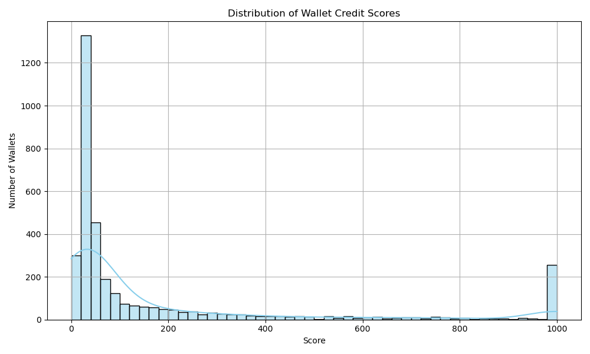

---

### ✅ Step 2: Create the `analysis.md`

This will be your **summary and insights** file.

#### Paste this into `analysis.md`:
```markdown
# 📊 Aave Credit Score Analysis

## 🧮 Score Distribution

The score distribution shows a clear separation between wallets with strong repayment behavior vs. risky wallets.



---

## 📉 Wallet Behavior Insights

### ✅ High Score Wallets (700-1000)
- Regular deposit activity
- High repayment to borrow ratio (> 0.8)
- Low or zero liquidations
- Interact with multiple assets responsibly

### ⚠️ Medium Score Wallets (400-699)
- Moderate borrowing with partial repayments
- Some liquidation events
- Less asset diversity

### 🚨 Low Score Wallets (0-399)
- Borrowed often without repayment
- Multiple liquidations
- Low deposit activity
- Minimal asset diversity

---

## 🧠 Conclusion

The model effectively identifies high-risk and low-risk wallets. It can be extended using:
- On-chain price volatility
- Historical wallet activity across protocols
- Machine learning models

This solution is scalable and explainable for integration into DeFi lending platforms.
